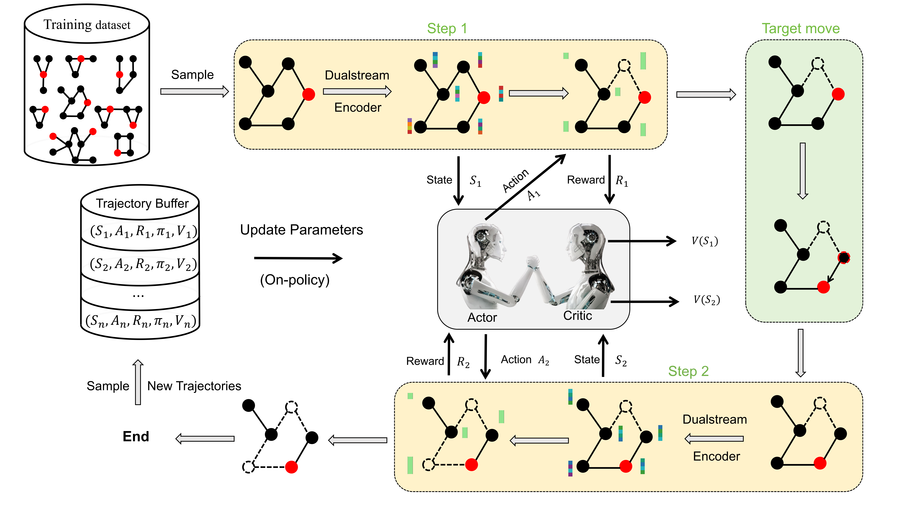

# MobileIsolator

[](LICENSE)

This repository contains the official code, data, and trained 
model weights accompanying the paper 
*Containment of Escaping Targets in Complex Networks*. The 
contents reproduce every figure and table reported in the main 
text and the Supplementary Information.

The paper introduces **MobileIsolator**, a Proximal-Policy-
Optimization agent backed by a dual-stream Graph Attention 
Network, that learns long-horizon node-removal policies to 
isolate a set of *mobile* target nodes from the largest connected 
component of a network. MobileIsolator is trained once on small 
synthetic graphs (Barabási–Albert and Watts–Strogatz, 
$50 \le N \le 100$) and is then evaluated zero-shot on much 
larger synthetic networks, on six real-world isolation scenarios 
drawn from public health, infrastructure protection, and 
security, and against three adaptive heuristic baselines as well 
as a Monte-Carlo-Tree-Search reference.


## Algorithm overview



MobileIsolator alternates between two phases at every decision 
step: (i) a structural stream applies multi-layer Graph Attention 
to encode each node's local topological role together with its 
proximity to the current target positions, and (ii) a global 
stream summarises episode-level state (remaining budget, current 
$\lambda$, target ratio) and broadcasts it back through a 
virtual node. The two streams are fused into a per-node action 
logit and a value head; the agent samples a removal action and 
the targets execute their stochastic random walk. Training uses 
PPO with $4 \times 10^6$ environment steps across $16$ parallel 
environments. The architecture, training distribution, and 
optimisation hyperparameters listed in Supplementary Table 4 are 
authoritatively defined in [`train/`](train/README_train.md).


## Repository structure

```
code_mobileisolator/
├── LICENSE
├── README.md                         (this file)
│
├── train/                            MobileIsolator training code + released model weights
│   └── README_train.md
│
├── fig1/                             Main-text Figure 1 (heuristic-failure motivation)
│   └── README_fig1.md
├── fig2/                             Main-text Figure 2 (algorithm schematic; no code)
├── fig3/                             Main-text Figure 3 (synthetic benchmark)
│   └── README_fig3.md
├── fig4/                             Main-text Figure 4 (scale generalization + robustness)
│   └── README_fig4.md
├── fig5/                             Main-text Figure 5 (real-time tracking analysis)
│   └── README_fig5.md
├── fig6/                             Main-text Figure 6 (six real-world scenarios)
│   └── README_fig6.md
│
└── fig_sm/                           Supplementary Information experiments
    ├── sm_fig1/                      SM Fig 1: lambda-collapse validity
    ├── sm_fig5/                      SM Fig 5: comparison with MCTS
    ├── sm_fig6/                      SM Fig 6: target-ratio generalization
    ├── sm_fig8/                      SM Fig 8: real-world full P_C and ANC curves
    ├── sm_fig9/                      SM Fig 9: fully vs batch adaptive strategies
    └── sm_table1_3/                  SM Tables 1-3: ablation study
```

Each leaf directory ships with its own README that documents 
inputs, outputs, configuration knobs, and reproduction commands. 
The remainder of this document is a navigation layer pointing 
into those READMEs.


## Quick start

The repository ships with every pre-computed CSV needed to 
re-render every figure in the paper. To verify your setup is 
working, render the main-text Figure 3 — the synthetic benchmark 
that compares MobileIsolator against the three adaptive 
heuristics across four topology–target regimes:

```bash
cd fig3
python draw_fig3_final.py
```

This should complete in well under a minute and produce four PDFs 
(plus PNGs) in `fig3/`:

```
draw_fig3_final_BA_random.pdf
draw_fig3_final_BA_localized.pdf
draw_fig3_final_WS_random.pdf
draw_fig3_final_WS_localized.pdf
```

If those four files appear and look like the main-text Figure 3, 
your installation is working and you can reproduce every other 
figure analogously.


## Reproducing the figures

The repository ships with the pre-computed data for every figure, 
so any single figure can be reproduced **without** running the 
expensive comparison scripts. The table below points to each 
figure's own README for full details.

### Main text

| Figure | What it shows | Directory |
|--------|---------------|-----------|
| Figure 1 | Motivation: heuristic baselines fail on mobile targets | [`fig1/`](fig1/README_fig1.md) |
| Figure 2 | Schematic of the MobileIsolator architecture | `fig2/` (PDF only) |
| Figure 3 | Four-method benchmark on synthetic BA / WS networks under random / localized target placement | [`fig3/`](fig3/README_fig3.md) |
| Figure 4 | Generalization to larger node scales and robustness under biased target movement | [`fig4/`](fig4/README_fig4.md) |
| Figure 5 | Time-resolved metrics tracking the geometry of MobileIsolator's removals | [`fig5/`](fig5/README_fig5.md) |
| Figure 6 | Six real-world isolation scenarios (COVID-19, invasive species, urban flood, smuggling, socialbot, fugitive chase) | [`fig6/`](fig6/README_fig6.md) |

### Supplementary Information

| Figure / Table | What it shows | Directory |
|----------------|---------------|-----------|
| SM Figs 2–4 | Per-regime breakdowns of Figure 3 | rendered alongside [`fig3/`](fig3/README_fig3.md) |
| SM Fig 1 | Validity of the evasion-factor $\lambda$ as a collapsed parameter | [`fig_sm/sm_fig1/`](fig_sm/sm_fig1/README_sm_fig1.md) |
| SM Fig 5 | MobileIsolator vs. Monte Carlo Tree Search | [`fig_sm/sm_fig5/`](fig_sm/sm_fig5/README_sm_fig5.md) |
| SM Fig 6 | Generalization beyond the training target-ratio range | [`fig_sm/sm_fig6/`](fig_sm/sm_fig6/README_sm_fig6.md) |
| SM Fig 7 | Variant of Fig 5 under localized targets | rendered alongside [`fig5/`](fig5/README_fig5.md) |
| SM Fig 8 | Full $P_C$ and ANC curves for the six real-world scenarios | [`fig_sm/sm_fig8/`](fig_sm/sm_fig8/README_sm_fig8.md) |
| SM Fig 9 | Fully-adaptive vs. batch-adaptive strategies | [`fig_sm/sm_fig9/`](fig_sm/sm_fig9/README_sm_fig9.md) |
| SM Tables 1–3 | Ablation study (No-Global / No-Attn / No-VNode) on real-world scenarios | [`fig_sm/sm_table1_3/`](fig_sm/sm_table1_3/README_sm_table1_3.md) |
| SM Table 4 | Hyperparameters and training-distribution configurations | documented in [`train/`](train/README_train.md) |


## Cross-directory dependencies

Several directories share resources rather than holding 
self-contained copies. The dependencies are summarised below.

```
                            train/
                       (trained MobileIsolator weights;
                        loaded by every script that
                        evaluates the agent)
                              ↑
   ┌──────────────┬───────────┴───────────┬──────────────┬─────────────────┐
   │              │                       │              │                 │
  fig3/        fig4/         fig5/      fig6/      fig_sm/sm_fig1/ ...  fig_sm/sm_table1_3/
   │              │           │            │
   │              ↓           ↓            │
   │     comparison_method  comparison_method
   │     (also from fig3)    (also from fig3)
   │
   └─────── fig_sm/sm_fig6/ imports from fig3/ for the same utility module


                              fig6/
                  (per-scenario real-world CSVs)
                              ↑
                  ┌───────────┴────────────┐
                  │                        │
            fig_sm/sm_fig8/         fig_sm/sm_table1_3/
            (renders full          (also imports the six
             P_C / ANC curves       scenario data scripts
             from fig6 CSVs)        as Python modules)
```

Concretely:

- **`train/` is loaded by every comparison script** that 
  evaluates MobileIsolator. The released weights live at 
  `train/gnn_ppo_dual_stream_n50-100__seed42__1769653775/model.pt`.
- **`fig3/comparison_method.py` is a shared utility module** 
  (heuristic implementations, simulators, graph generators, 
  $\lambda$-parameter conversion). It is imported by 
  `fig4/`, `fig5/`, `fig6/`, `fig_sm/sm_fig1/`, `fig_sm/sm_fig6/`, 
  and `fig_sm/sm_table1_3/`.
- **`fig6/data/fig6_data/` holds the six released real-world 
  network topologies.** Both `fig_sm/sm_fig8/` (reading per-
  scenario results CSVs) and `fig_sm/sm_table1_3/` (importing the 
  six data scripts as modules) reuse this data, rather than 
  shipping their own copy.
- **`fig_sm/sm_table1_3/` ships its own three ablation model 
  weights** (No-Global / No-Attn / No-VNode), because they are 
  used only by that experiment. The full MobileIsolator weights 
  it also needs are loaded from `train/`.

All paths are resolved at run-time relative to each script's own 
location, so the full repository can be cloned and run as-is 
without manual path edits, provided the directory layout above is 
preserved.


## Platform notes

All scripts run on Linux, macOS, and Windows. The data-generating 
comparison scripts use Python's `ProcessPoolExecutor` with 
per-worker `initializer` callbacks, so they do not depend on the 
Unix-only `fork` multiprocessing start method and work unchanged 
under the `spawn` start method that Windows uses by default. On 
Windows, the number of multiprocessing workers is automatically 
capped at $60$ in every script (due to the 63-handle limit of the 
`WaitForMultipleObjects` API); on Linux / macOS the original 
worker counts are used.

GPU acceleration is recommended but not required: training 
MobileIsolator from scratch (see [`train/`](train/README_train.md)) 
strongly benefits from CUDA; rendering figures from the shipped 
CSVs runs comfortably on CPU.


## Requirements

The code targets Python 3.10+. The full dependency list is in 
[`requirements.txt`](requirements.txt). Briefly:

- `numpy`, `pandas`, `scipy`, `tqdm`
- `networkx`
- `matplotlib`, `seaborn`
- `gymnasium` (for the training environment)
- `torch`, `torch-geometric` (for evaluating or retraining 
  MobileIsolator)
- `tensorboard` (only for inspecting training curves; not needed 
  for inference)

For Conda users:

```bash
conda create -n mobileisolator python=3.10
conda activate mobileisolator
conda install -c pytorch -c nvidia pytorch pytorch-cuda=12.1
pip install torch-geometric
pip install -r requirements.txt
```

Replace `pytorch-cuda=12.1` with `cpuonly` for a CPU-only install. 
Adjust the CUDA version to match your driver. Note that 
`torch-geometric` is installed separately because its wheels are 
sensitive to the PyTorch / CUDA versions; see 
[the PyG install guide](https://pytorch-geometric.readthedocs.io/en/latest/install/installation.html) 
for platform-specific instructions.


## Data sources

Each of the six real-world scenarios in Figure 6 uses a published 
network dataset. The full citations are listed in 
[`fig6/README_fig6.md`](fig6/README_fig6.md).


## Citation

If you use any of the code, data, or model weights in this 
repository, please cite the main paper.
